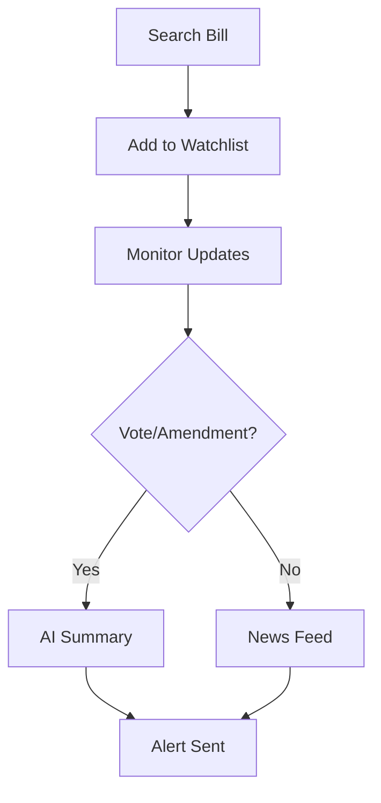

## Overview

State Affairs provides comprehensive tools for tracking legislation across all 50 states. You can monitor bills, receive real-time state news, and get AI-driven policy insights tailored to your needs. Customize alerts and feeds to focus on specific topics, ensuring you stay informed without information overload.

<Callout kind="info">
State Affairs delivers nonpartisan, on-the-ground intelligence. Focus on actionable insights for advocacy, research, or compliance.
</Callout>

## Key Features

Explore the core capabilities that power your policy monitoring workflow.

<Columns cols={3}>
  <Card title="Bill Tracking" icon="search" href="#bill-tracking">
    Monitor legislation status, sponsors, and amendments in real-time across states.
  </Card>
  <Card title="AI Policy Insights" icon="zap" href="#ai-insights">
    Get automated summaries, impact analysis, and predictive trends.
  </Card>
  <Card title="Custom Alerts" icon="bell" href="#custom-alerts">
    Set keyword-based notifications via email, webhooks, or dashboard feeds.
  </Card>
</Columns>

## Tracking Bills and State News

Follow bills from introduction to enactment with detailed timelines and related news.

### Set Up Bill Tracking

<Steps>
  <Step title="Search Bills" icon="search">
    Navigate to the dashboard and enter bill numbers or keywords like `HB 123` or `climate policy`.
  </Step>
  <Step title="Add to Watchlist" icon="plus">
    Click the star icon to track changes. Receive updates on votes, hearings, and text amendments.
  </Step>
  <Step title="View News Context" icon="newspaper">
    Access linked state news articles and press releases for context.
  </Step>
</Steps>



## AI-Powered Policy Analysis and Summaries

Leverage AI to distill complex legislation into clear insights.

<Tabs>
  <Tab title="Bill Summary" icon="file-text">
    Generate concise overviews of bill content.

    <CodeGroup tabs="API,Dashboard">
    ````javascript
    const response = await fetch('https://api.example.com/v1/bills/summary', {
      method: 'POST',
      headers: { 'Authorization': 'Bearer YOUR_API_KEY' },
      body: JSON.stringify({ billId: 'HB123-CA' })
    });
    const summary = await response.json();
    console.log(summary.text);
    ````
    ````bash
    curl -X POST https://api.example.com/v1/bills/summary \
      -H "Authorization: Bearer YOUR_API_KEY" \
      -d '{"billId": "HB123-CA"}'
    ````
    </CodeGroup>
  </Tab>
  <Tab title="Impact Analysis" icon="trending-up">
    Assess potential effects on stakeholders.

    AI evaluates fiscal impact, sector relevance, and passage likelihood.
  </Tab>
</Tabs>

<Callout kind="tip">
Combine AI summaries with your keyword alerts for proactive monitoring.
</Callout>

## Customizing Feeds and Keyword Alerts

Tailor your dashboard to specific interests.

| Feature | Description | Customization Options |
|---------|-------------|-----------------------|
| Keyword Alerts | Real-time notifications for terms like `renewable energy` | States, bill stages, email/webhook |
| Custom Feeds | Personalized news and bill streams | Filters by topic, sponsor, committee |
| Export Options | Download data for reports | CSV, PDF, API |

Set up alerts via the dashboard or API.

<ParamField path="keywords" param-type="array" required="true">
Array of search terms, e.g., `["tax reform", "education funding"]`.
</ParamField>

<ParamField header="Authorization" param-type="string" required="true">
Bearer token for API access.
</ParamField>

## Real-World Use Cases

<ExpandableGroup>
  <Expandable title="Advocacy Organizations" default-open="true">
    Track bills impacting your cause. Use AI insights to prepare testimony and lobby strategically.

    Example: Monitor `healthcare reform` across states and get summaries before committee hearings.
  </Expandable>
  <Expandable title="Research and Academia">
    Aggregate data for studies. Export bill histories and news for analysis.

    Integrate with tools via webhooks for automated research pipelines.
  </Expandable>
  <Expandable title="Corporate Compliance">
    Set alerts for regulatory changes. Ensure teams stay compliant with state laws.
  </Expandable>
</ExpandableGroup>

## Best Practices

- Start with broad keywords, then refine based on results.
- Use AI summaries daily to prioritize high-impact bills.
- Integrate webhooks for seamless workflows with your CRM or Slack.

<Columns cols={2}>
  <Card title="Quickstart" icon="rocket" href="/quickstart">
    Set up your first alert.
  </Card>
  <Card title="API Reference" icon="code" href="/authentication">
    Build custom integrations.
  </Card>
</Columns>