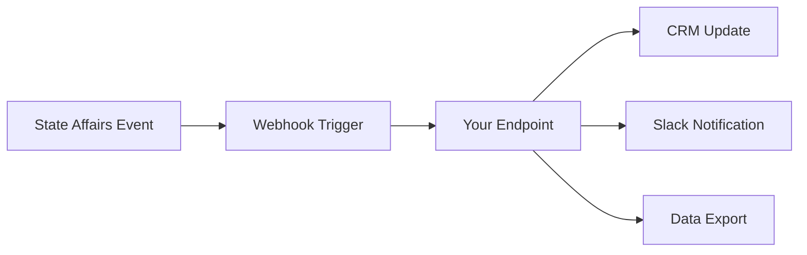

## Overview

State Affairs supports seamless integrations with popular tools to streamline your workflow. Configure webhooks for instant notifications, connect to CRM systems like Salesforce or HubSpot, export data via API endpoints, and sync with the mobile app for on-the-go access.

Use these integrations to automate alerts, enrich customer data, and maintain real-time synchronization across platforms.

<Callout kind="info">
Review your account permissions before setting up integrations. Contact support if you need elevated access.
</Callout>

## Webhook Configuration

Webhooks deliver real-time updates on legislative events, bill changes, or keyword alerts directly to your endpoint.

### Set Up a Webhook

Follow these steps to create and test a webhook.

<Steps>
  <Step title="Create Webhook" icon="settings">
    Navigate to your dashboard at `https://pro.stateaffairs.com` > Integrations > Webhooks.

    Click "New Webhook" and enter your endpoint URL, such as `https://your-webhook-url.com/webhook`.

    Select events like `bill_updated` or `keyword_alert`.
  </Step>
  <Step title="Configure Payload" icon="code">
    Choose JSON format and add optional headers.

    Test the configuration with the built-in verifier.
  </Step>
  <Step title="Verify Delivery" icon="check-circle">
    Monitor the webhook logs in your State Affairs dashboard for successful deliveries.
  </Step>
</Steps>

### Webhook Payload Example

State Affairs sends POST requests to your endpoint with event data.

<Response tabs="bill_updated,keyword_alert" show-lines="true">
```json
{
  "event": "bill_updated",
  "data": {
    "bill_id": "HB-123",
    "state": "CA",
    "title": "Education Reform Act",
    "status": "passed_committee"
  },
  "timestamp": "2024-10-15T10:30:00Z"
}
```

```json
{
  "event": "keyword_alert",
  "data": {
    "keyword": "tax reform",
    "matches": [
      {
        "bill_id": "SB-456",
        "snippet": "The bill introduces new tax reforms..."
      }
    ]
  },
  "timestamp": "2024-10-15T11:00:00Z"
}
```
</Response>

<Callout kind="tip">
Secure your webhook endpoint with HMAC signatures. Use the `X-State-Affairs-Signature` header for verification.
</Callout>

## CRM and Email Integrations

Connect State Affairs to your CRM or email tools for automated workflows.

<Tabs>
  <Tab title="Salesforce" icon="database">
    Use Zapier or native webhooks to push bill updates to Salesforce records.

    <CodeGroup tabs="JavaScript,Python">
    ````javascript
    const zapierWebhook = 'https://hooks.zapier.com/hooks/catch/YOUR_ZAP_ID/';
    
    fetch(zapierWebhook, {
      method: 'POST',
      headers: { 'Content-Type': 'application/json' },
      body: JSON.stringify(stateAffairsData)
    });
    ````

    ````python
    import requests
    
    zapier_webhook = 'https://hooks.zapier.com/hooks/catch/YOUR_ZAP_ID/'
    
    requests.post(zapier_webhook, json=state_affairs_data)
    ````
    </CodeGroup>
  </Tab>
  <Tab title="HubSpot" icon="users">
    Map keyword alerts to HubSpot contacts via API.

    Create a custom workflow in HubSpot to ingest State Affairs data.
  </Tab>
  <Tab title="Slack/Email" icon="mail">
    Route notifications to Slack channels or email lists.

    Use the webhook URL provided by Slack: `https://hooks.slack.com/services/YOUR/SLACK/WEBHOOK`.
  </Tab>
</Tabs>

## Data Exports and API Access

Export legislative data or query via API for custom analysis.

### API Endpoints

Key endpoints include bill search and state tracking.

<ParamField path="bills/{state}" param-type="GET" required="true">
Search bills by state code (e.g., `CA`, `NY`).
</ParamField>

<ParamField query="keyword" param-type="string" required="false">
Filter by keywords like `tax reform`.
</ParamField>

<ParamField header="Authorization" param-type="string" required="true">
Bearer `{YOUR_API_KEY}`.
</ParamField>

```javascript
const response = await fetch('https://api.stateaffairs.com/v1/bills/CA?keyword=tax', {
  headers: {
    'Authorization': 'Bearer YOUR_API_KEY'
  }
});
```

## Mobile App Synchronization

Sync your State Affairs dashboard with the mobile app for notifications and tracking.

<Columns cols={2}>
  <Card title="iOS Setup" icon="apple" href="https://stateaffairs.com/mobile-app">
    Download from App Store and link your account.
  </Card>
  <Card title="Android Setup" icon="monitor" href="https://stateaffairs.com/mobile-app">
    Install via Google Play and enable push notifications.
  </Card>
</Columns>

<Steps>
  <Step title="Enable Sync" icon="sync">
    In the app, go to Settings > Integrations > Enable Dashboard Sync.
  </Step>
  <Step title="Customize Alerts" icon="bell">
    Select tracked bills and keywords for mobile alerts.
  </Step>
</Steps>

## Popular Integrations

Discover ready-to-use connections.

<Columns cols={3}>
  <Card title="Zapier" icon="zap" href="https://zapier.com/apps/state-affairs/integrations">
    Automate workflows with 5000+ apps.
  </Card>
  <Card title="Google Sheets" icon="file-spreadsheet" href="#">
    Export bill data directly to sheets.
  </Card>
  <Card title="Airtable" icon="database" href="#">
    Sync legislative intel to your bases.
  </Card>
</Columns>

